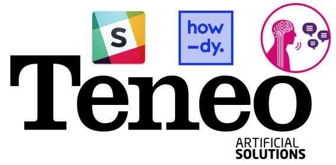

# Botkit-template-for-heroku-slack-teneo

Slack based Botkit template for Heroku. This will allow you to quickly get a Slack bot running against Teneo.

## What Is the Teneo Platform?

Teneo is an Enterprise-strength NLI development and analytics platform that allows business users and developers to collaborate on creating sophisticated natural language applications in record time without the need for specialist linguistic skills. Created by [Artificial Solutions](https://www.artificial-solutions.com/).

You can get started your Teneo backed bot right now. just click the button! 😉

## Let's make your bot!

### 1. Click the below button!

### 2. Input the Slack token for your bot, specify your Teneo endpoint URL and deploy!

### 3. Then, you have to switch from 'web dyno' to 'worker dyno' by hand.

### 4. Here we go! Enjoy developing your bot. 😁🤖
